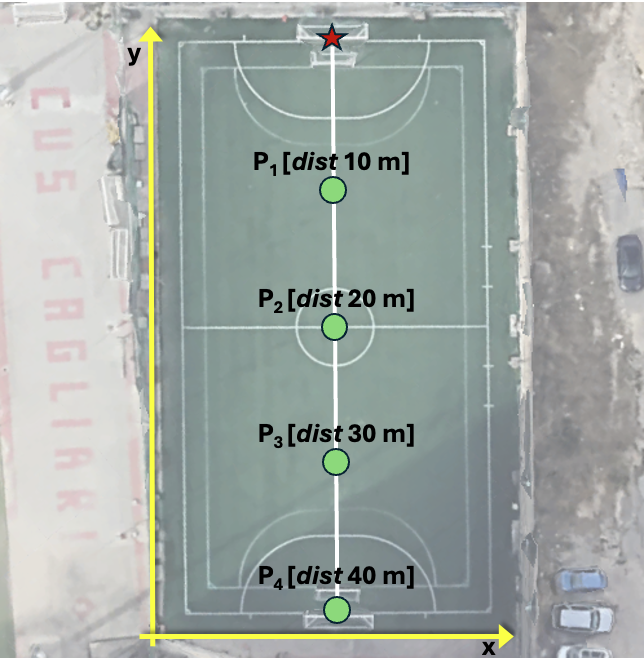
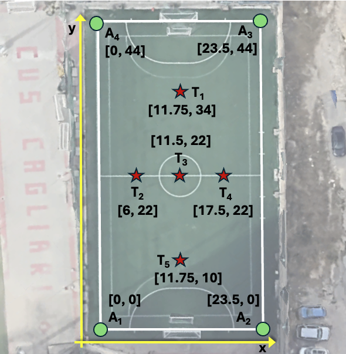

# RSSI-Based Localization Dataset

This repository contains a dataset of Received Signal Strength Indicator (RSSI) measurements acquired through a proof-of-concept testbed using IoT-compliant devices with LoRa communication. The dataset is intended for research on wireless localization, signal propagation analysis, and the performance evaluation of RSS-based algorithms in realistic outdoor settings. This work is carried out as part of the POSIDONIA project, funded under the third open call of the NGI Sargasso initiative.
---

## 📦 Dataset Overview

The dataset was collected using a Raspberry Pi 5 as the **target device** and multiple Adafruit Feather 32u4 RFM95 nodes as **anchors**. All devices operate at the 868.0 MHz frequency. RSSI readings were gathered across three distinct outdoor scenarios, with varying distances and placements between nodes to simulate different propagation conditions.

---

## 🛠️ Hardware Setup

- **Target Device**  
  - Raspberry Pi 5  
  - Adafruit RFM95W LoRa module (connected via serial interface)  
  - Mounted on a tripod at 1.3 meters height

- **Anchor Nodes**  
  - Adafruit Feather 32u4 with RFM95  
  - Mounted on tripods at 1.3 meters height  
  - Transmit packets periodically (random interval between 2 and 3 seconds)

---

## 💻 Software Stack

- **Target Side**
  - Python script using the `adafruit_rfm9x` library
  - Tasks:
    - Receive and filter packets from anchors
    - Extract RSSI values and anchor IDs
    - Store data in structured CSV format

- **Anchor Side**
  - Arduino sketches with the `RH_RF95` library
  - Tasks:
    - Periodically transmit packets with unique identifiers

---

## 🧪 Scenarios & Data Collection

Data was collected on a football field at the *Centro Universitario Sportivo (CUS)*, "Sa Duchessa", University of Cagliari, Italy.

### 📍 Scenario A – Linear Distance Test
- Goal: Analyze the RSSI-distance relationship.
- Setup: One anchor moved linearly from 10 to 40 meters in 10-meter steps while the target remains stationary.
  

### 📍 Scenario B – Grid-Based Deployment
- Goal: RSSI measurement with fixed anchors and varied target positions.
- Setup: Four anchors around a 23.5×44 m² rectangle. The target is placed at five positions (T1–T5).
  

> ℹ️ Additional scenarios and conditions will be added in future dataset updates.

---

## 🧱 Dataset Structure

The dataset is organized into folders, each corresponding to a specific acquisition scenario:
- Scenario A: Contains a separate JSON file for each tested distance between anchor and target.
- Scenario B: Includes one JSON file per target position within a rectangular deployment area.

Inside each folder, there are different JSON files corresponding to each test based on the target position. Note that the filenames provide information about the specific target position.

Each JSON file contains a collection of entries, where each entry represents a received packet and includes the following fields:
- Timestamp: Reception time of the packet.
- Latitude and Longitude: GPS position of the target
- Anchor: ID of the transmitting anchor node.
- Tx_pwr: Transmission power (in dBm).
- Freq: Frequency used for transmission (in MHz).
- RSSI: Received Signal Strength Indicator (in dBm).
- SNR: Signal-to-Noise Ratio (in dB).

(e.g.   {"Timestamp": "2025-03-18 10:33:14", "Latitude": 39.23062565, "Longitude": 9.1131206, "Anchor": "2", "Tx_pwr": 13, "Freq": 868.0, "RSSI": -91, "SNR": 6.5}

This structured format allows for straightforward parsing and facilitates statistical analysis, model training, and evaluation of RSS-based techniques in realistic outdoor settings.

## 📬 Contact

For further questions, feel free to reach out by emailing me at giovanni.pettorru@unica.it or by opening an issue.
